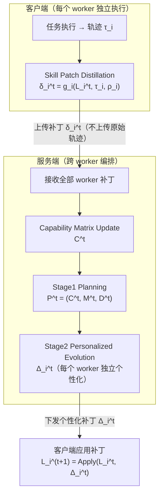

# FederatedSkill Reproduction

本项目复现论文 **《FederatedSkill: Federated Learning for Agentic Skill Evolution》**
（arXiv:2606.03143），用于科研 / 课程复现实验展示。

> 代码来源声明：算法实现（联邦循环、Stage1 规划、Stage2 合并、Capability Matrix、
> Patch 蒸馏等）为独立实现，未复制官方仓库任何 `.py` 源码；`prompts/` 目录下的
> Stage1/Stage2 提示词按"实验配置"性质保留了官方原文（与超参数、模型名等实验
> 条件同类，不属于算法源码），`patch_prompt.txt`（Patch 蒸馏提示词）为本项目自研。
> 完整的逐函数核验记录见 [docs/detailed_verification_report.md](docs/detailed_verification_report.md)。

---

## 1. Project Overview

FederatedSkill 提出了一套让多个异构 Agentic Worker（不同 backbone 模型 + 不同
Agent Harness）在完成任务的过程中，把自己的执行经验蒸馏成结构化"技能补丁"，
上传给服务端做能力感知的规划与个性化合并，从而实现技能的联邦式演化。

本仓库主要实现：

- **Skill Patch Extraction**（技能补丁蒸馏）：客户端把一次任务执行的轨迹
  τ_i 压缩、蒸馏为结构化补丁 δ_i^t = (upserts, deletions, reward, summary)，
  只上传补丁本身，原始轨迹绝不离开客户端。
- **Server-side Evolution Planning**（服务端演化规划）：服务端维护跨 worker
  的能力矩阵 C^t（covered / absorbing / broken / gap 四态），并基于它生成
  演化计划 P^t = (C^t, M^t, D^t)。
- **Personalized Skill Aggregation**（个性化技能聚合）：服务端针对每个
  worker 单独执行 Stage2 合并，产出面向该 worker 的个性化补丁 Δ_i^t，而不是
  对所有 worker 广播同一份更新。
- **Heterogeneous Agent Federation**（异构 Agent 联邦）：支持不同 backbone
  （Qwen / GLM / Kimi / Claude）与不同 Agent Harness（claude-code / qwen-code
  / kimi-cli）混合组成的联邦实验（Setting 3 / Setting 4）。

---

## 2. Repository Structure

```
FederatedSkill-Reproduction/
├── core/                    # 数据模型 + 常量 + 异常
│   ├── datatypes.py         # 所有 Pydantic 模型（对应上表）
│   ├── constants.py         # 超参数（K_STEP=20, K_OBS=3000等）
│   └── exceptions.py        # 异常层次定义
│
├── llm/                     # LLM调用抽象层（多模型支持）
│   ├── backbone.py          # LLMBackbone基类
│   ├── router.py            # BackboneRouter路由表（worker_id→LLM实例）
│   └── prompt_builder.py    # 提示词构建工具
│
├── prompts/                 # 三份提示词文本（与代码解耦）
│   ├── stage1_*.txt         # Stage1规划提示词
│   ├── stage2_*.txt         # Stage2合并提示词
│   └── patch_prompt.txt     # Patch蒸馏提示词
│
├── client/                  # **客户端侧**（每个Worker一份实例）
│   ├── federated_client.py  # FederatedClient（协调端点）
│   ├── executor.py          # TaskExecutor（5步执行流：检索→构建→生成→执行→验证）
│   ├── distiller.py         # PatchDistiller（7步蒸馏流：压缩→快照→解析→LLM→验证）
│   ├── library.py           # SkillLibrary（技能库读写）
│   ├── trajectory.py        # TrajectoryCompressor（轨迹压缩）
│   └── agent_runtime/       # 真实CLI Agent运行时支持
│
├── server/                  # **服务端侧**（跨Worker单例）
│   ├── evolution.py         # FederatedServer（run_round总调度）
│   ├── planner.py           # EvolutionPlanner（Stage1规划）
│   ├── merge.py             # EvolutionExecutor（Stage2执行，per-worker）
│   ├── capability.py        # CapabilityTracker（能力矩阵管理）
│   ├── memory.py            # EvolutionMemoryStore（跨轮记忆机制）
│   └── prompt_builder.py    # Stage1/Stage2提示词构建
│
├── benchmark/               # 任务与数据集
│   ├── family.py            # TaskFamily（同一技能的递增难度任务序列）
│   ├── task.py              # Task（单个任务定义）
│   ├── verifier.py          # VerificationResult（奖励计算）
│   ├── families/            # 25个family JSON（20个真实SkillFlow+5个手写）
│   └── skillflow_adapter/   # 真实SkillFlow数据集下载与格式转换
│
├── executor/                # 真实任务执行沙箱
│   └── agent_executor.py    # 支持真实workspace模式的executor
│
├── evaluation/              # 论文指标计算与分析
│   ├── metrics.py           # 核心指标（成功率、覆盖度等）
│   ├── cost_accounting.py   # 成本审计（Appendix C）
│   ├── capability_tracker.py# 能力矩阵演化追踪
│   └── reporter.py          # 报告与绘图
│
├── experiments/             # 统一实验入口
│   └── run_experiment.py    # CLI入口 + Setting1-4配置
│
├── scripts/                 # 工具脚本
│   ├── select_representative_families.py  # 代表性子集选取
│   └── 其他预检与验证脚本
│
└── docs/                    # 复现文档
    ├── paper_mapping.md             # 论文↔代码对照
    ├── detailed_verification_report.md  # 函数级核验记录
    └── analysis_notes/              # 历史分析记录
```

各目录用途简述：

| 目录 | 用途 |
|---|---|
| `core/` | 论文符号 ↔ 代码的 Pydantic 数据模型与全局常量、异常定义 |
| `llm/` | 统一 LLM 调用层（多 provider 路由、重试、成本统计） |
| `prompts/` | Stage1/Stage2/Patch 提示词文本（实验配置，非算法源码） |
| `client/` | 客户端执行、Patch 蒸馏、技能库管理、Agentic 执行循环 |
| `server/` | 服务端 Stage1 规划、Stage2 个性化合并、能力矩阵、记忆机制 |
| `benchmark/` | 任务/family 数据、采样器、验证器、真实 SkillFlow 数据集适配 |
| `executor/` | 真实/沙箱任务执行运行时（无 Docker 依赖） |
| `harness/` | 真实 CLI Agent Harness 适配 |
| `evaluation/` | 论文指标计算、跨轮评估、报告与绘图 |
| `experiments/` | 实验 CLI 入口与 Setting1-4 / 消融配置 |
| `scripts/` | 环境预检、数据集下载、代表性子集实验流程工具 |
| `docs/` | 复现方法论、论文对照文档、历史分析记录归档 |
| `results/` | 实验运行产出（本地生成，不提交到 git） |

### 2.1 关键包内部文件职责（细粒度）

**`client/`（客户端，每个 worker 一份实例）**

| 文件 | 职责 |
|---|---|
| `client/federated_client.py` | `FederatedClient`：把 `SkillLibrary` + `PatchDistiller` 封装成客户端统一接口（`distill_patch()` / `apply_update()` / `library_snapshot()`） |
| `client/executor.py` | `TaskExecutor`：技能检索→Prompt构建→LLM生成代码→沙箱执行→验证 五步流程，产出 `Trajectory` |
| `client/distiller.py` | `PatchDistiller`：轨迹压缩→库快照→结果提取→LLM蒸馏→隐私审计 五步流程，产出 `WorkerPatch`（不含原始轨迹） |
| `client/library.py` | `SkillLibrary`：技能库的读（`snapshot()`/`digest()`）与写（`apply_patch()`） |
| `client/trajectory.py` | `TrajectoryCompressor`：轨迹压缩为蒸馏用的紧凑表示 |
| `client/agent_runtime/` | Planner-Action-Observation 循环（真实 CLI Agent 场景的运行时支持） |

**`server/`（服务端，跨 worker 单例）**

| 文件 | 职责 |
|---|---|
| `server/evolution.py` | `FederatedServer`：`run_round()` 串联 Stage1→Stage2，`create()` 一次性组装 Planner/Executor/CapabilityTracker/MemoryStore |
| `server/planner.py` | `EvolutionPlanner.plan()`：Stage1，基于能力矩阵 + 各 worker 补丁生成 `EvolutionPlan P^t` |
| `server/merge.py` | `EvolutionExecutor`：Stage2，对每个 worker 单独调用一次 LLM，产出个性化 `MergedPatch Δ_i^t` |
| `server/capability.py` | `CapabilityTracker`：跨轮次能力矩阵 `C^t`（covered/absorbing/broken/gap 四态） |
| `server/memory.py` | `EvolutionMemoryStore`：两级记忆（high-level/low-level）存储与更新 |
| `server/logging.py` | `DecisionLogger`：Stage2 每条合并决策的可审计日志 |

**`executor/` + `harness/`（任务执行的两条路径）**

| 文件 | 职责 |
|---|---|
| `executor/router_executor.py` | `VerificationAwareExecutor`：按 `task.verification.type` 路由到 `TaskExecutor` 或 `SkillFlowTaskExecutor` |
| `executor/skillflow_executor.py` | 需要真实工作区（写文件+跑测试脚本）的 SkillFlow 任务执行器 |
| `executor/harness_executor.py` | `HarnessAwareExecutor`：`execution_mode="cli"` 时的执行入口，委托 `harness/factory.py` |
| `executor/mock_executor.py` / `python_executor.py` | 不发真实 LLM 请求的 mock 执行器 / 纯 Python 沙箱执行器 |
| `harness/factory.py` | `get_harness()`：按 `agent_harness` 名称（claude-code/qwen-code/kimi-cli）分派到具体 CLI Harness，或 debug 模式回退到 `APIWorkspaceHarness` |
| `harness/claude_code_harness.py` `qwen_code_harness.py` `kimi_cli_harness.py` | 三种真实 CLI Agent 的 subprocess 适配 |
| `harness/api_workspace_harness.py` | 不依赖真实 CLI 二进制的 API 回退实现（debug 模式） |

**`evaluation/`（指标计算与产出）**

| 文件 | 职责 |
|---|---|
| `evaluation/evaluator.py` | `ExperimentEvaluator`：每轮 `record_round()`，结束时 `finalize()` 汇总为 `ExperimentResult` |
| `evaluation/metrics.py` | `FederatedMetrics`：success_rate / compression_ratio / privacy_gain / weighted_global_score 等核心指标 |
| `evaluation/capability_tracker.py` | `CapabilityEvolutionTracker`：Figure 3 用的跨轮能力/库演化历史 |
| `evaluation/cost_accounting.py` | `CostAccountant`：Appendix C 成本复现审计（按 component 记录每次 LLM 调用花费） |
| `evaluation/selr.py` | `compute_selr_from_texts()`：Table 8 Skill-Exposed Leakage Rate 计算 |
| `evaluation/paper_export.py` | 论文 Table1/Figure2-4 风格的 CSV 导出 + `LEGACY_ENGINEERING_FAMILY_IDS` 定义 |
| `evaluation/plotter.py` | `--plot` 参数触发的 Figure 2/3/4 绘图 |

---

## 3. Core Algorithm Implementation

对应论文 **Algorithm 1**（联邦技能演化主循环）：



对应源码入口：

| 阶段 | 源码 |
|---|---|
| 客户端 Patch 蒸馏 | [client/distiller.py](client/distiller.py) `PatchDistiller.distill()` |
| 服务端整体编排（Stage1+Stage2 串联） | [server/evolution.py](server/evolution.py) `FederatedServer.run_round()` |
| Stage1 能力矩阵 + 规划 | [server/planner.py](server/planner.py) `EvolutionPlanner.plan()`，[server/capability.py](server/capability.py) `CapabilityTracker` |
| Stage2 个性化合并 | [server/merge.py](server/merge.py) `EvolutionExecutor` |
| 补丁应用 | [client/library.py](client/library.py) `SkillLibrary.apply_patch()` |

更详细的论文符号 ↔ 代码逐条对照（含函数签名核实、行号引用）见
[docs/paper_mapping.md](docs/paper_mapping.md) 与
[docs/detailed_verification_report.md](docs/detailed_verification_report.md)。

### 3.1 完整调用链路（从命令行到落盘结果）

以 `python experiments/run_experiment.py --config experiments/configs/setting_homo_fed.yaml --rounds 8` 为例，
一次实验运行按下列顺序逐层调用（均为实际源码路径，非示意）：

```
experiments/run_experiment.py  (CLI 入口)
├─ _load_yaml() + _validate_experiment_config()      # 加载/校验 YAML，缺字段直接报错，不静默用默认值
├─ _apply_paper_benchmark_scope() + _apply_family_subset()
│     benchmark/family.py::load_all_families()        # 加载 benchmark/families/ 下 25 个 family JSON
├─ 按 worker 节点构建 core/datatypes.py::WorkerProfile
├─ llm/router.py::BackboneRouter.from_profiles()      # 每个 worker 一个 llm/backbone.py::LLMBackbone
├─ 按 cfg["federated"] 分流：
│  │
│  ├─ False → experiments/baseline.py::SelfEvolutionRunner   （Setting1 Self-Evolve）
│  │            └─ 每个 client 独立循环 rounds 次：
│  │                 client/federated_client.py::FederatedClient
│  │                   ├─ executor/router_executor.py::VerificationAwareExecutor.run()
│  │                   │     ├─ verification.type ∈ {skillflow_script, docker}
│  │                   │     │     → executor/skillflow_executor.py::SkillFlowTaskExecutor.run()
│  │                   │     └─ 否则 → client/executor.py::TaskExecutor.run()
│  │                   │           （Step1 技能检索 → Step2 Prompt 构建 → Step3 LLM 生成代码 →
│  │                   │            Step4 沙箱执行 → Step5 benchmark/verifier.py 验证 → Trajectory）
│  │                   │     （execution_mode="cli" 时改由
│  │                   │      executor/harness_executor.py::HarnessAwareExecutor
│  │                   │      → harness/factory.py::get_harness() 按 agent_harness 名称分派到
│  │                   │      harness/claude_code_harness.py / qwen_code_harness.py /
│  │                   │      kimi_cli_harness.py 三选一真实 CLI 子进程，或 debug 模式下的
│  │                   │      harness/api_workspace_harness.py::APIWorkspaceHarness）
│  │                   ├─ FederatedClient.distill_patch(trajectory)
│  │                   │     → client/distiller.py::PatchDistiller.distill()
│  │                   │       （Step1 轨迹压缩 → Step2 库快照 → Step3 试验结果提取 →
│  │                   │        Step4 LLM 蒸馏补丁 → Step5 隐私审计，返回 WorkerPatch，
│  │                   │        原始轨迹绝不进入返回值）
│  │                   └─ 无服务端参与：WorkerPatch 直接
│  │                        client/library.py::SkillLibrary.apply_patch() 写回自己的库
│  │
│  └─ True  → experiments/federated.py::FederatedRunner       （Setting2-4 联邦）
│               ├─ server/evolution.py::FederatedServer.create()（Stage1/Stage2/能力矩阵/记忆一次性组装）
│               └─ 每轮 run_round(t) 编排 Algorithm 1 三段式：
│                    ① Client Phase：与上面 SE 流程一致，采集全体 worker 的 WorkerPatch + LibrarySnapshot
│                    ② Server Phase：server/evolution.py::FederatedServer.run_round()
│                         ├─ Stage1: server/planner.py::EvolutionPlanner.plan()
│                         │     依赖 server/capability.py::CapabilityTracker（跨轮能力矩阵 C^t）
│                         │     与 server/memory.py::EvolutionMemoryStore（两级记忆）
│                         └─ Stage2: server/merge.py::EvolutionExecutor
│                               对每个 worker 单独调用一次，产出个性化 MergedPatch Δ_i^t
│                    ③ Apply Phase：每个 client 调用
│                         client/library.py::SkillLibrary.apply_patch(merged_patch)
│                         → L_i^{t+1} = Apply(L_i^t, Δ_i^t)
│
└─ 每轮结束：evaluation/evaluator.py::ExperimentEvaluator.record_round()/finalize()
      ├─ evaluation/metrics.py::FederatedMetrics.compute_all()      # success_rate / compression_ratio / privacy_gain 等
      ├─ evaluation/capability_tracker.py::CapabilityEvolutionTracker  # Figure 3 用的库/能力演化历史
      ├─ evaluation/cost_accounting.py::CostAccountant                # Appendix C 成本审计
      ├─ evaluation/selr.py::compute_selr_from_texts()                 # Table 8 SELR 隐私泄漏率
      └─ evaluation/reporter.py / paper_export.py / plotter.py         # 落盘 CSV/JSON + (--plot) Figure2/3/4
```

**关键设计点（写 README 时容易忽略、但影响复现正确性）：**

- **Setting1（SE）与 Setting2-4（联邦）复用同一套 client 侧组件**
  （`FederatedClient` / `TaskExecutor` / `PatchDistiller` / `SkillLibrary`），
  唯一区别是补丁应用路径：SE 直接 apply 自己的 `WorkerPatch`；联邦场景下补丁先经过
  `FederatedServer.run_round()` 两阶段处理，client 应用的是服务端个性化生成的 `MergedPatch`
  （`experiments/baseline.py` 与 `experiments/federated.py` 顶部 docstring 明确写了这个区别）。
- **`execution_mode` 参数决定任务执行走 API 模拟还是真实 CLI**：
  `"api"`（默认）经 `executor/router_executor.py` 直接调用 LLM 生成代码并沙箱执行；
  `"cli"` 经 `executor/harness_executor.py` → `harness/factory.py::get_harness()` 启动真实
  `claude-code` / `qwen-code` / `kimi-cli` 子进程（对应 `--execution-mode cli` CLI 参数）。
- **`paper_benchmark_only` 配置项**控制是否从 25 个 family（20 官方 + 5 本项目自建 legacy）
  过滤到论文official 的 20 个，过滤发生在任务执行/指标聚合**之前**（`run_experiment.py::_apply_paper_benchmark_scope()`），
  避免 legacy family 的数据被静默混入 Table 1/Figure 2/3 的聚合结果。
- **隐私边界**：`PatchDistiller.distill()` 返回的 `WorkerPatch` 结构上就不包含原始轨迹字段，
  Stage2 `EvolutionExecutor` 处理的也只是补丁摘要与库快照，原始执行轨迹 `Trajectory` 全程只留在
  产生它的 client 本地——这是论文"补丁不含原始轨迹"隐私保证在代码层面的落地位置。

---

## 4. Experiment Settings

| Setting | 说明 | 配置文件 |
|---|---|---|
| 1. Self-Evolve | 单一 worker，不与服务端联邦协作，只验证客户端自我演化（Patch 蒸馏 + 本地技能库迭代）闭环 | [experiments/configs/setting_se.yaml](experiments/configs/setting_se.yaml) |
| 2. Homogeneous Federated | 多个 worker，**相同** backbone 模型与 Agent Harness，验证同构联邦协作（Stage1+Stage2 完整闭环） | [experiments/configs/setting_homo_fed.yaml](experiments/configs/setting_homo_fed.yaml) |
| 3. Heterogeneous Backbone | 多个 worker，**不同** backbone 模型（Qwen/GLM/Kimi），相同 Agent Harness，验证跨模型能力迁移 | [experiments/configs/setting_hetero_backbone.yaml](experiments/configs/setting_hetero_backbone.yaml) |
| 4. Full Heterogeneity | 多个 worker，backbone 与 Agent Harness（claude-code/qwen-code/kimi-cli）均不同，最贴近真实异构部署场景 | [experiments/configs/setting_full_hetero.yaml](experiments/configs/setting_full_hetero.yaml) |

此外还提供 3 项消融实验配置（`experiments/configs/ablation_a1_no_capability_matrix.yaml`
去掉能力矩阵、`ablation_a2_global_library.yaml` 改为全局共享技能库、
`ablation_a3_full_trajectory.yaml` 上传完整轨迹而非蒸馏后的补丁），用于验证
各机制对最终效果的贡献。

---

## 5. Running Experiments

### 5.1 环境准备

```bash
pip install -r requirements.txt          # 基础依赖
pip install -r requirements-real.txt     # 真实 API 实验额外依赖（纯 ASCII，规避编码问题）
```

复制 `.env.example` 为 `.env`，填入真实 API Key（`QWEN_DASHSCOPE_API_KEY` /
`GLM_DASHSCOPE_API_KEY` / `KIMI_DASHSCOPE_API_KEY` / `ANTHROPIC_*`，具体变量名
见各 `experiments/configs/*.yaml` 中 worker 的 `api_key_env` 字段）。

### 5.2 数据集准备

本仓库使用真实 **SkillFlow-Task** 数据集（20 个官方 family），下载后落地于
`benchmark/cache/SkillFlow-Task/`（约 1.6GB）。**该目录不随本仓库提交/分发**
（已在 `.gitignore` 中排除），首次运行前需自行下载一次：

```bash
python scripts/download_skillflow_dataset.py       # 完整下载数据集（HuggingFace snapshot_download）
python scripts/fetch_skillflow_instructions.py     # 轻量版：仅下载 instruction.md + task.toml
```

下载完成后，`benchmark/families/` 下的 family JSON 会引用该缓存目录中的真实
任务内容；未下载数据集时，`benchmark/skillflow_adapter/` 会回退到内置的
synthetic fixture，可用于跑通流程但不代表真实论文数据。

### 5.3 运行前预检（可选，强烈建议）

```bash
python scripts/preflight_check.py         # 真实实验前置环境检查
python scripts/check_api_connection.py    # 逐 provider 验证 API Key / 端点可达性
```

### 5.4 运行实验

统一入口为 `experiments/run_experiment.py`（YAML 驱动，支持 Setting1-4 + 消融 + 单/多 family 独立运行）：

```bash
# 仅打印配置摘要，不发起任何真实 LLM 调用（用于校验配置是否正确）
python experiments/run_experiment.py --config experiments/configs/setting_se.yaml --dry-run

# Setting 1（Self-Evolve）：单 family 独立运行
python experiments/run_experiment.py --config experiments/configs/setting_se.yaml \
    --family Cross-Format-Data-Reconciliation

# Setting 2（Homogeneous Federated）：跑 8 轮，覆盖配置中的 rounds
python experiments/run_experiment.py --config experiments/configs/setting_homo_fed.yaml --rounds 8

# Setting 4（Full Heterogeneity）：自定义输出目录 + 实验结束后自动绘图
python experiments/run_experiment.py --config experiments/configs/setting_full_hetero.yaml \
    --output results/hetero_run1 --plot

# 当前配置可用的全部 family 逐个独立运行（每个 family 一个全新 experiment_id）
python experiments/run_experiment.py --config experiments/configs/setting_se.yaml --all-families

# 消融实验 A1（不使用能力矩阵）
python experiments/run_experiment.py --config experiments/configs/ablation_a1_no_capability_matrix.yaml

# 不需要 API Key 的 mock 模式（验证联邦闭环结构，不发出真实请求）
python experiments/run_experiment.py --config experiments/configs/setting_se.yaml --mock-federated
```

也可以使用 `experiments/runner.py::ExperimentRunner.for_setting(1..4)` 作为
Python 内调用的门面类，等价映射到上述 4 个 Setting 配置文件。

### 5.5 代表性子集实验（可选，用于快速验证）

`scripts/select_representative_families.py` → `scripts/validate_subset_protocol.py`
→ `scripts/preflight_representative_subset.py` → `scripts/run_representative_subset.py`
提供了一套从 20 个官方 family 中选取代表性子集、校验协议、预检、运行的完整
工具链，用于在不跑全部 family 的情况下快速验证联邦流程（详见各脚本内 docstring）。

---

## 6. Results

实验结果统一保存在 `results/` 目录（未提交到 git，需自行运行实验生成），按
`<experiment_id>/<family_id>/` 或 `<setting_name>/families/<family_id>/`
组织，每个 family 目录下包含：

- **success rate**：`round_NNN_summary.json` / `experiment_summary.json` 中的
  `per_worker[...][success_rate]`、`FederatedMetrics.success_rate()` 计算结果
- **capability improvement**：`capability_matrix.jsonl`（跨轮
  covered/absorbing/broken/gap 状态计数演化，由
  `evaluation/capability_tracker.py::CapabilityEvolutionTracker` 记录并可导出 CSV）
- **skill library evolution**：`libraries/<worker_id>/` 下每轮技能库快照
  （新增/编辑/删除的技能文件），以及 `evolution_trace.jsonl` 记录的每条
  Stage2 决策（absorb/repair/refactor/no_update）

已生成的论文用汇总表格示例见
[results/subset_setting1_v3/paper_tables_v1/](results/subset_setting1_v3/paper_tables_v1/)
（success rate 对比表、跨轮技能演化表、technical skill reuse 轨迹表等 9 个 CSV）。

---

## 延伸阅读

| 文档 | 内容 |
|---|---|
| [docs/paper_mapping.md](docs/paper_mapping.md) | 论文符号 ↔ 代码详细对照表 |
| [docs/experiment_settings.md](docs/experiment_settings.md) | 4 种 Setting 的详细配置说明 |
| [docs/real_experiment_setup.md](docs/real_experiment_setup.md) | 真实 API 实验环境搭建指南 |
| [docs/reproduction_protocol.md](docs/reproduction_protocol.md) | 复现方法论与代码来源声明 |
| [docs/SIMPLIFICATIONS.md](docs/SIMPLIFICATIONS.md) | 全仓库简化点清单 |
| [docs/detailed_verification_report.md](docs/detailed_verification_report.md) | 逐函数源码核实报告（本仓库此前的完整版 README） |
| [docs/analysis_notes/](docs/analysis_notes/) | 历史专项分析记录（执行链路、prompt 对齐、家族选取等） |

---

## Citation

```bibtex
@article{federatedskill2026,
  title   = {FederatedSkill: Federated Learning for Agentic Skill Evolution},
  journal = {arXiv preprint arXiv:2606.03143},
  year    = {2026}
}
```
