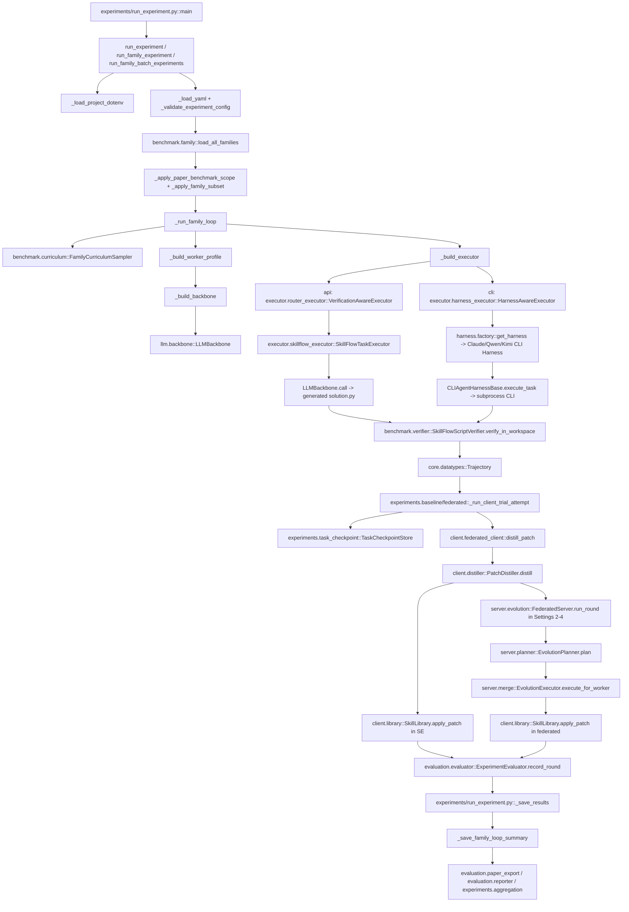

# End-to-End Execution Call Graph

Scope: static audit of current `FederatedSkill-Reproduction` code. No code changes. Entry analyzed: `experiments/run_experiment.py` with the current family-loop experiment protocol.

## Primary Path: Setting 1-4 Family Loop

## Concrete File/Function Edges

| Step | Current implementation | Confirmed call source | Status |
|---|---|---|---|
| Entry | `experiments/run_experiment.py::main()` | CLI | Confirmed |
| `.env` load | `_load_project_dotenv()` | `run_experiment`, `run_family_experiment`, `run_family_batch_experiments` | Confirmed |
| Config validation | `_validate_experiment_config()` | before sampler/worker construction | Confirmed |
| Family loader | `benchmark.family.load_all_families()` | `run_experiment` / `run_family_experiment` | Confirmed |
| Paper family filter | `_apply_paper_benchmark_scope()` | before scheduling | Confirmed |
| Scheduler | `FamilyCurriculumSampler.sample()` | `SelfEvolutionRunner._run_round`, `FederatedRunner._run_round` | Confirmed |
| Worker profile | `_build_worker_profile()` | `_run_family_loop` | Confirmed |
| Backbone | `_build_backbone()` -> `LLMBackbone.from_worker_profile()` | worker/server construction | Confirmed |
| Executor selection | `_build_executor()` | `_run_family_loop` / flat run | Confirmed |
| API task execution | `VerificationAwareExecutor` -> `SkillFlowTaskExecutor` | default `execution_mode='api'` | Confirmed, but not official CLI harness |
| CLI task execution | `HarnessAwareExecutor` -> `CLIAgentHarnessBase` | only `--execution-mode cli` | Implemented but not default |
| Verifier | `SkillFlowScriptVerifier.verify_in_workspace()` | `SkillFlowTaskExecutor` / harness workspace verify path | Confirmed |
| Trajectory | `core.datatypes.Trajectory` | executor return value | Confirmed |
| Checkpoint | `TaskCheckpointStore.save_trajectory_reward/save_success` | runner trial attempt | Confirmed |
| Distiller | `PatchDistiller.distill()` | `FederatedClient.distill_patch()` | Confirmed |
| Library apply | `SkillLibrary.apply_patch()` | SE direct, federated after merge | Confirmed |
| Planner | `EvolutionPlanner.plan()` | `FederatedServer.run_round()` | Confirmed for federated settings |
| Merge | `EvolutionExecutor.execute_for_worker()` | `FederatedServer._execute_worker_directives()` | Confirmed for federated settings |
| Evaluator | `ExperimentEvaluator.record_round/finalize` | SE/federated runner | Confirmed |
| Family summary | `_save_family_loop_summary()` | after family loop | Confirmed |
| Paper CSV | `evaluation.paper_export.export_family_loop_csvs()` | called manually / exporter workflows | Implemented; not automatically invoked by `run_experiment.py` family-loop |

## Main Audit Finding

The current execution graph is traceable end to end from `run_experiment.py` to `experiment_summary.json`. However, the default path is **API-compatible execution**, not the official CLI harness path. The official-like CLI path exists but requires `--execution-mode cli` and installed/configured `claude`, `qwen`, or `kimi` binaries.
